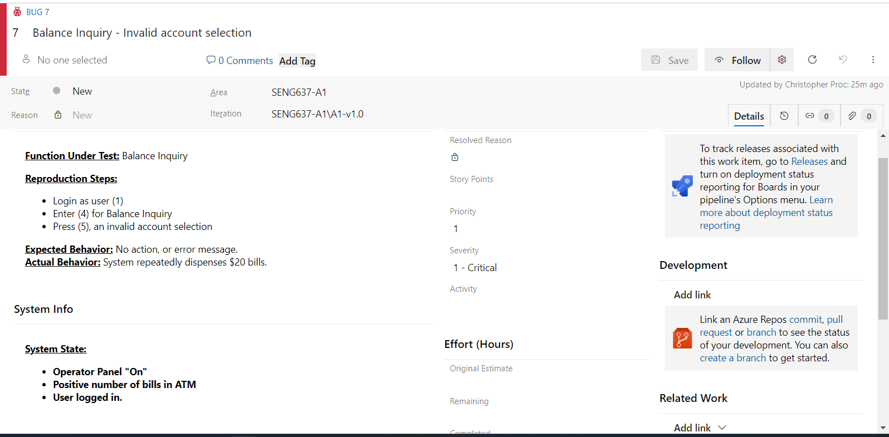

>   **SENG 637 - Dependability and Reliability of Software Systems**

**Lab. Report \#1 – Introduction to Testing and Defect Tracking**

| Group: Group Number      |
|-----------------|
| Christopher Proc         |   
| Sean Buchanan            |   
| Chris Brunet             |  

**Table of Contents**

(When you finish writing, update the following list using right click, then
“Update Field”)

[1 Introduction	1](#_Toc439194677)

[2 High-level description of the exploratory testing plan	1](#_Toc439194678)

[3 Comparison of exploratory and manual functional testing	1](#_Toc439194679)

[4 Notes and discussion of the peer reviews of defect reports	1](#_Toc439194680)

[5 How the pair testing was managed and team work/effort was
divided	1](#_Toc439194681)

[6 Difficulties encountered, challenges overcome, and lessons
learned	1](#_Toc439194682)

# Introduction

An introduction of your lab work, and what you knew about exploratory and manual
functional testing before this lab

# High-level description of the exploratory testing plan

In order to create a useful exploratory testing plan, first we reviewed the requirements document contained within Appendix B. This review identified a number of system behaviours and constraints that the software must meet. Once we identified these behaviours and constraints, we used them to generate a list of common use-cases which would model the end user behaviour. As this was exploratory rather than scripted, our testing plan was not intended to be fully exhaustive, instead we designed it to provide opportunities to explore most or all of the use cases, and to perform roughly two tests for every major system behavior listed in the requirements document. We wanted the tester to explore one positive test (normal behaviour expected to function normally), and one negative test where possible (abnormal behaviour expected to fail). We also did additional exploratio for any specific constraints outlined within the requirements document (eg. only dispensing $20 bills). When a specific behaviour could have multiple options such as transferring money between a selection of accounts, we only decided to test one combination to test the underlying functionality, rather than the specific combination of inputs. This is an area that could be investigated further during scripted or exhaustive testing. 

We felt that this framework would allow us to give a wide span of attention to the overall performance of the system, and give insight into any areas which would warrant further attention if necessary for a more in-depth series of tests.

A list of the identified use-case actions, the associated positive and negative tests that we performed while exploring, and any additional test cases are listed below.

| Behaviour | Positive Exploratory action | Negative Exploratory action | 
| ----------| -------------------| -------------------| 
| User inserts card | Valid Card number | Invalid Card Number | 
| User enters pin | Valid pin for valid card | Invalid pin for valid card |
| Cash withdrawal | Amount less than in account | Amount more than in account | 
| Deposit money   | 
| Transfer Money  | Amount less than in account 1 | Amount more than in account 1|
| Balance Inquiry | Account listed on the display | Invalid account |
| Operator switch | Toggled while no customer present | Toggled while customer is present | 

| Additional test cases | 
| ----------------------|
| Withdrawal of amount not in denominations of $20 |
| Pin retry, incorrect pin, followed by correct pin | 
| Cancel transaction | Cancel during valid transaction |
| Retain card, three incorrect pin tries | 
| Examine log entries, complete, no pin #s |

One hour of exploratory testing and bug recording following the above test plan resulted in 6 bugs being recorded and tracked.

# Comparison of exploratory and manual functional testing

| MFT Test Case | Result | Bug Report | 
| --------------| -------| ---------- | 
| 01 | Success | 
| 02 | Success |
| 03 | Success | 
| 04 | Success | 
| 05 | Success | 
| 06 | Failure | 8 | 
| 07 | Success | 
| 08 | Failure | 4 - Existing Bug|
| 09 | Success | 
| 10 | Success | 
| 11 | Success | 
| 12 | Success | 
| 13 | Success | 
| 14 | Failure | 3 - Existing Bug | 
| 15 | Success | 
| 16 | Failure | 9 | 
| 17 | Success | 
| 18 | Success | 
| 19 | Success | 
| 20 | Success | 
| 21 | Success | 
| 22 | Failure | 6 - Existing Bug | 
| 23 | Success | 
| 24 | Success | 
| 25 | Success | 
| 26 | Success | 
| 27 | Success | 
| 28 | Success | 
| 29 | Failure | 5 - Existing Bug | 
| 30 | Success |
| 31 | Success | 
| 32 | Success | 
| 33 | Failure | 11 | 
| 34 | Success | 
| 35 | Success |
| 36 | Success | 
| 37 | Failure | 2 - Existing Bug | 
| 38 | Success | 
| 39 | Failure | 2 - Existing Bug | 
| 40 | Failure | 2 - Existing Bug | 

-   Note that you need to submit a report generated by your defect tracking
    system, containing all defects recorded in the system.

# Notes and discussion of the peer reviews of defect reports

Text…

# How the pair testing was managed and team work/effort was divided 

Text…

# Difficulties encountered, challenges overcome, and lessons learned

Notes:
- Test case 3 was unclear - Didn't specify logon.
- Test case 37, 39, and 40 contain duplicate test cases.
- Some tests needed further exploratory testing to determine proper behavior - Eg. Test case 33. Doesn't show all account types - this is legitimate behavior for one user, but not another. Correct behavior is unknown - should it show accounts that the user doesn't have?

