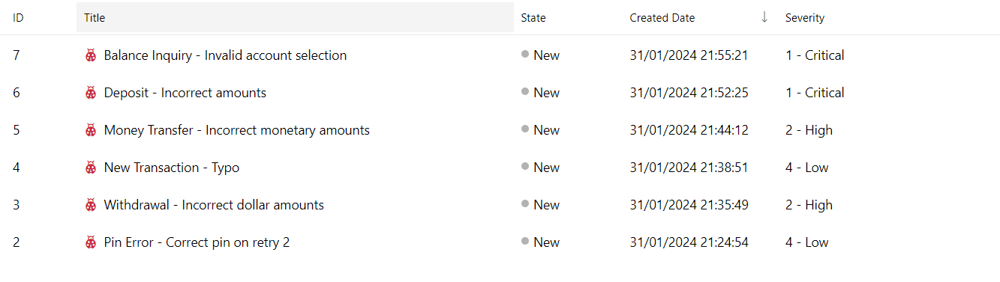
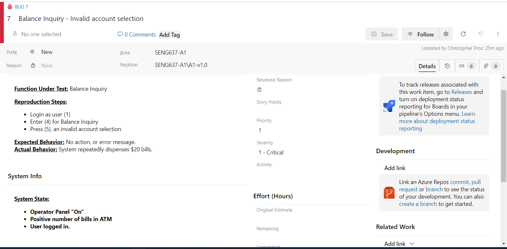

>   **SENG 637 - Dependability and Reliability of Software Systems**

**Lab. Report \#1 – Introduction to Testing and Defect Tracking**

| Group: #5      |
|-----------------|
| Christopher Proc         |   
| Sean Buchanan            |   
| Chris Brunet             |  

**Table of Contents**

(When you finish writing, update the following list using right click, then
“Update Field”)

[1 Introduction	1](#_Toc439194677)

[2 High-level description of the exploratory testing plan	1](#_Toc439194678)

[3 Comparison of exploratory and manual functional testing	1](#_Toc439194679)

[4 Notes and discussion of the peer reviews of defect reports	1](#_Toc439194680)

[5 How the pair testing was managed and team work/effort was
divided	1](#_Toc439194681)

[6 Difficulties encountered, challenges overcome, and lessons
learned	1](#_Toc439194682)

# Introduction

During this lab, we will be conducting different testing methods (Exploratory Testing, Manual Functional Testing) on a System Under Test (SUT), in order to gain familiarity with testing, bug reporting tools, and the effectiveness of different testing types.

All of the group members have prior experience with exploratory software testing, and two of them have conducted manual functional testing prior to this lab in previous work. 

# High-level description of the exploratory testing plan

In order to create a useful exploratory testing plan, all members needed to be familiar with the SUT. First we reviewed the requirements document contained within Appendix B. This review identified a number of system behaviours and constraints that the software must meet. As well, each team member independently completed the system familiarization, outlined within the assignment document.

As this was exploratory rather than scripted, our testing plan was not intended to be fully exhaustive. Instead we proposed to provide opportunities to explore most or all of the use cases, and to perform roughly two tests for every major system behavior listed in the requirements document. We wanted the tester to explore one positive test (normal behaviour expected to function normally), and one negative test where possible (abnormal behaviour expected to fail). We also encouraged exploring any specific constraints outlined within the requirements document (eg. only dispensing $20 bills). Testers were encouraged to dig deeper if they saw any errors, or were curious about a behaviour. When a function could have multiple options such as transferring money between a selection of accounts, testers weren't directed to exhaustively test all the options, but to only pick one or two. This is an area that could be investigated further during scripted or exhaustive testing. 

We felt that this framework would allow us to give a wide span of attention to the overall performance of the system, and give insight into any areas which would warrant further attention if necessary for a more in-depth series of tests.

### High-level testing plan: 
#### Type
- Exploratory
#### Objective
- Provide broad test coverage of the entire SUT, while allowing for the focused inspection of any areas of concern, and deep probing of any discovered errors.
#### Scope
- All functions outlined within the design document should be tested.
- Aim for positive and negative tests, ensure correct function according to design, and resilience to incorrect inputs.
- Not every combination of inputs or functions needs to be tested
#### Logistics
 - Exploratory testing to be conducted independently by two teams of pair-testers
 - Testers to keep brief notes on the areas that were tested, to consolidate as an artifact.
#### Exit Criteria
- Finish after 30-60 minutes of testing per team.
#### Resources
- SUT V1.0
- Test log.  

### Consolidated exploratory test log, V1.0:

This log summarizes the notes that the pair testers took when conducting exploratory testing on V1.0. This allowed us to see what the total coverage of the testing was, and what kinds of actions they were testing.

| Behaviour | Positive Exploratory action | Negative Exploratory action | 
| ----------| -------------------| -------------------| 
| User inserts card | Valid Card number | Invalid Card Number | 
| User enters pin | Valid pin for valid card | Invalid pin for valid card |
| Cash withdrawal | Amount less than in account | Amount more than in account | 
| Deposit money   | Correct deposit | Invalid Amounts |
| Transfer Money  | Amount less than in account 1 | Amount more than in account 1|
| Balance Inquiry | Account listed on the display | Invalid account |
| Operator switch | Toggled while no customer present | Toggled while customer is present | 

| Additional test cases | 
| ----------------------|
| Withdrawal of amount not in denominations of $20 |
| Pin retry, incorrect pin, followed by correct pin | 
| Cancel transaction | Cancel during valid transaction |
| Retain card, three incorrect pin tries | 
| Examine log entries, complete, no pin #s |

### Results
One hour of exploratory testing per team following the above test plan resulted in 6 bugs being recorded and tracked.

Bugs found during exploratory testing: 

Sample Bug Report: 

### Manual functional testing logs - V1.0 and V1.1
#### Version 1.0
This test log is for the purposes of recording the results of the MFT test cases being conducted as part of the initial testing on V1.0

| MFT Test Case | Result | Bug Report | 
| --------------| -------| ---------- | 
| 01 | Success | 
| 02 | Success |
| 03 | Success | 
| 04 | Success | 
| 05 | Success | 
| 06 | Failure | 8 | 
| 07 | Success | 
| 08 | Failure | 4 - Existing Bug|
| 09 | Success | 
| 10 | Success | 
| 11 | Success | 
| 12 | Success | 
| 13 | Success | 
| 14 | Failure | 3 - Existing Bug | 
| 15 | Success | 
| 16 | Failure | 9 | 
| 17 | Success | 
| 18 | Success | 
| 19 | Success | 
| 20 | Success | 
| 21 | Success | 
| 22 | Failure | 6 - Existing Bug | 
| 23 | Success | 
| 24 | Success | 
| 25 | Success | 
| 26 | Success | 
| 27 | Success | 
| 28 | Success | 
| 29 | Failure | 5 - Existing Bug | 
| 30 | Success |
| 31 | Success | 
| 32 | Success | 
| 33 | Failure | 11 | 
| 34 | Success | 
| 35 | Success |
| 36 | Success | 
| 37 | Failure | 2 - Existing Bug | 
| 38 | Success | 
| 39 | Failure | 2 - Existing Bug | 
| 40 | Failure | 2 - Existing Bug | 

MFT for V1.0 resulted in 3 new bugs being reported, for a total of 9.

#### Version 1.1
This test log is for the purposes of recording the results of the MFT test cases being conducted as a part of regression testing V1.1.

| MFT Test Case | Result | Bug Report | 
| --------------| -------| ---------- | 
| 01 | Success | 
| 02 | Success |
| 03 | Success | 
| 04 | Success | 
| 05 | Success | 
| 06 | Success |
| 07 | Success | 
| 08 | Success |
| 09 | Success | 
| 10 | Success | 
| 11 | Success | 
| 12 | Success | 
| 13 | Failure | 12 |
| 14 | Failure | 13 | 
| 15 | Success | 
| 16 | Success | 
| 17 | Success | 
| 18 | Success | 
| 19 | Success | 
| 20 | Success | 
| 21 | Success | 
| 22 | Failure | 6 - Existing Bug | 
| 23 | Success | 
| 24 | Success | 
| 25 | Success | 
| 26 | Success | 
| 27 | Success | 
| 28 | Success | 
| 29 | Failure | 5 - Existing Bug | 
| 30 | Success |
| 31 | Success | 
| 32 | Success | 
| 33 | Success |
| 34 | Success | 
| 35 | Success |
| 36 | Success | 
| 37 | Failure | 2 - Existing Bug | 
| 38 | Success | 
| 39 | Failure | 2 - Existing Bug | 
| 40 | Failure | 2 - Existing Bug | 

Re-evaluating the results of the bug list from V1.0 on the new version, as well as re-conducting MFT on V1.1 resulted in 7 bugs being resolved, 3 being active, and 4 new bugs being reported.

A final consolidated report of all of the individual bug reports and fixes is available in the attached [Azure Bug Reports Spreadsheet](SENG637-Azure-Bug-Report.xlsx)

# Comparison of exploratory and manual functional testing

During this assignment, both Exploratory and Manual Functional Testing were used. Both methods resulted in bugs being discovered and reported, including several errors identified by both. Exploratory testing intially found 6 bugs on Version 1.0 of the SUT. MFT on the same version confirmed 5 of those bugs, and found 4 additional bugs. Overall, both were effective at finding bugs, however the exploratory testing did manage to find a critical, high-priority bug (#7) that MFT missed. V1.1 was only tested with MFT, so no comparisons can be made.

#### Bugs found in V1.0 by method
| Exploratory Only | MFT Only | Both |
| :---: | :---: | :---: | 
| 1 | 4 | 5 |

### Exploratory Testing
#### Pros
- Allowed the flexibility to explore problem areas more deeply, and find root-causes or generalizations of errors.
- Worked well with pair testing, and resulted in wider test-coverage when conducted with different people. 
- Allowed creativity to find novel errors.
- More engaging to the testers.
#### Cons
- Hard to ensure complete or balanced coverage of all functions and use cases.
- Less repeatability in testing, aside from re-testing generated bug reports
- Required high familiarity with the SUT, and lots of cross-referencing with the design document to assess expected behavior.
- Effectiveness depends on the enthusiasm and skill of the tester.

### Manual Functional Testing
#### Pros
- Provided a framework to ensure all core functions were tested.
- Repeatable
- Produces concrete logs for the artifacts, showing the history of the SUT.
- Required less familiarity with the system to conduct.
#### Cons
- Difficult to think of test-cases to cover all possible use-cases.
- Inflexible, will always miss all errors not directly tested by a test case.
- No variability in the depth of testing

Overall, both testing methods were valuable in testing the system.

# Notes and discussion of the peer reviews of defect reports

Text…

# How the pair testing was managed and team work/effort was divided 

Initially, each member of the group read through the assignment instructions, and conducted the familiarization portion of the assignment with the SUT V1.0. 

Pair testing was then conducted, with both partners having an opportunity to conduct manual inspection of the SUT as well as analyzing and entering bug reports into Azure DevOps. Two sets of pair testing were conducted with different partners, in order to allow everyone a chance to participate and contribute to the report. 

The first round of manual scripted testing was conducted as a group, in accordance with Appendix C. Responsibility for conducting the test cases, writing bug reports, and filling out the testing log were rotated and shared amongst the group members.

Similarly, regression testing was conducted as a group. All bugs were assigned and re-tested to check for fixes, and then the entire manual test script was re-done on V1.1. Bugs were closed, updated, or created by the group member assigned to that portion of the testing. 

All members contributed equally to the final analysis of the results, and the writing of the report.

# Difficulties encountered, challenges overcome, and lessons learned

### Difficulties and Challenges
- When working in a team setting, it can be difficult to agree on a common framework for testing - what is or isn't a bug, severity of a bug, etc. 
- It was commonly very difficult to discover the full scope of a bug. Often an error would occur, but further testing showed that it was a small part of a larger set of errors. It wasn't always clear when to probe deeper. 
- Some of the MFT test cases were ambiguous, or difficult to understand. For example, test case 3 didn't specify a logon. Test cases 37, 39, and 40 seemed to duplicate testing efforts. 
- Some test cases needed further exploratory testing to determine proper behaviour which wasn't specified in the system requirementes document. For example, test case 33 doesn't show all account types, but the correct behavior isn't specified anywhere. It was occasionally unclear if a bug should be raised of not. 
### Lessons Learned

- It was very valuable to discuss standards and formatting for bug reports prior to starting pair testing. This allowed everyone to produce similar reports, and to have a common benchmark for severity.
- The team implemented a standard template within Azure DevOps, which was loaded for each new work item. This ensured that all the necessary information would be included in each report. 

